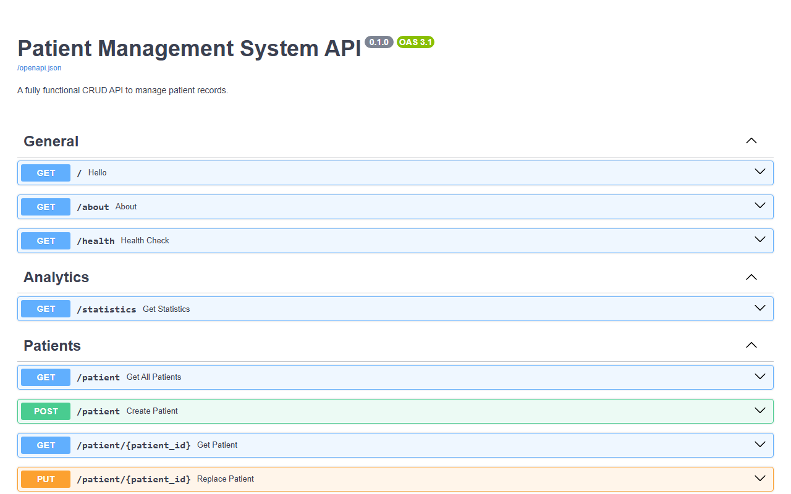
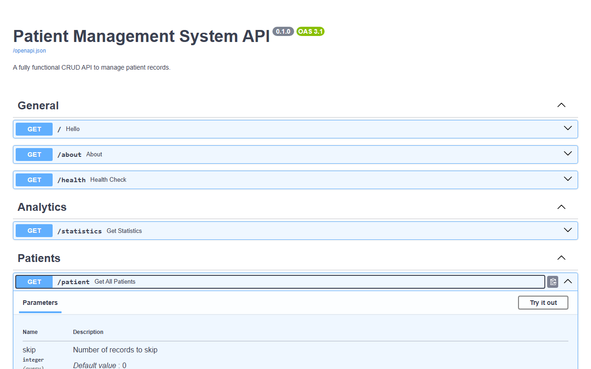
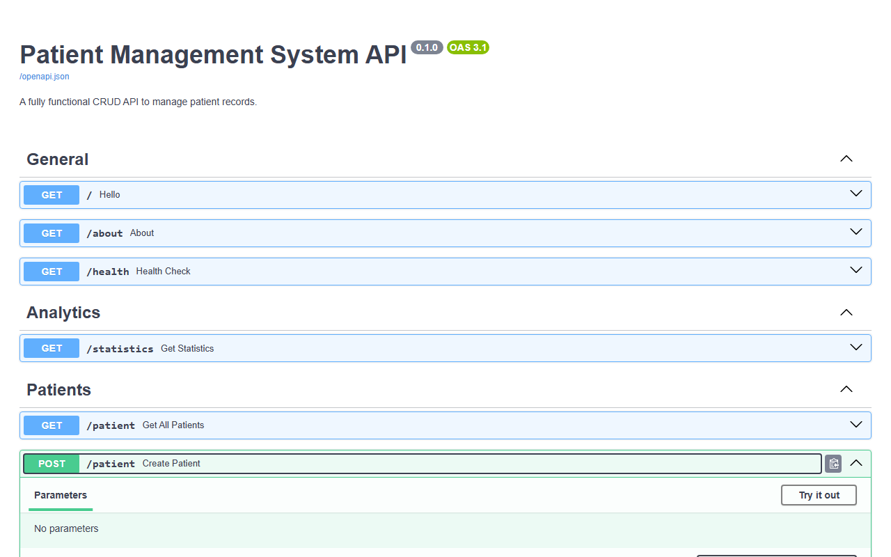
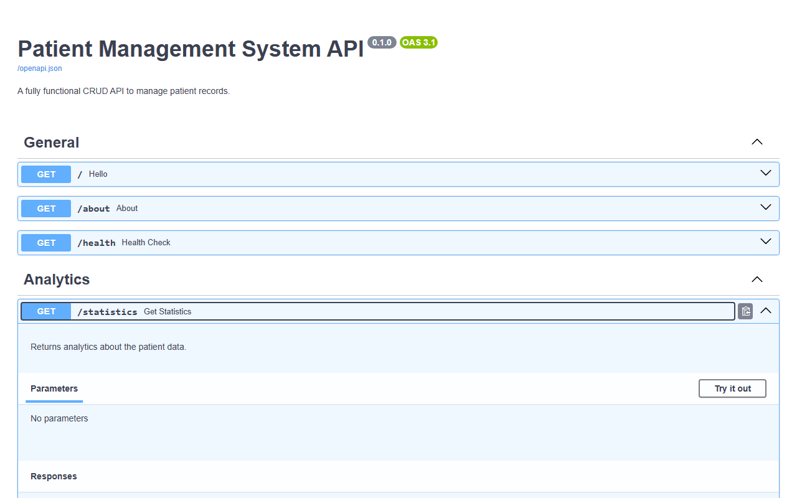

# Patient Management System API

A fully functional CRUD API for managing patient records, built with **FastAPI**. It computes each patient's BMI and health verdict automatically, and supports filtering, searching, sorting, and basic analytics.

## Overview

This project provides a lightweight backend for storing and managing patient data. Patient records are persisted in a local `patient.json` file, and BMI / health verdict are computed dynamically from height and weight using Pydantic's `computed_field`.

## Features

- **Full CRUD** — create, retrieve, update (partial and full), and delete patient records
- **Automatic BMI calculation** — BMI and health verdict (`Underweight`, `Normal`, `Overweight`, `Obese`) are computed on the fly
- **Filtering & search** — filter patients by city, gender, or partial name match
- **Sorting** — sort by height, weight, or BMI, ascending or descending
- **Pagination** — `skip` and `limit` query parameters on the list endpoint
- **Analytics endpoint** — aggregate statistics including average age, gender distribution, and verdict distribution
- **Auto-generated docs** — interactive Swagger UI and ReDoc via FastAPI
- **CORS enabled** — configured for open access during development

## Project Structure

```
├── app.py                    # Application entry point and route definitions
├── patient.json               # Local data store for patient records
├── requirements.txt            # Python dependencies
├── LICENSE
└── screenshots/                 # Endpoint screenshots
    ├── hello.png
    ├── about.png
    ├── health.png
    ├── statistics.png
    ├── get-all-patients.png
    ├── get-patient.png
    ├── sort-patient.png
    ├── create-patient.png
    ├── replace-patient.png
    ├── update-patient.png
    ├── delete-patient.png
    └── swagger-home.png
```

## Getting Started

### Prerequisites

- Python 3.9+

### Installation

```bash
# Clone the repository
git clone <repository-url>
cd <repository-directory>

# Install dependencies
pip install -r requirements.txt
```

### Running the API

```bash
uvicorn app:app --reload
```

The API will be available at `http://127.0.0.1:8000`, with interactive documentation at `http://127.0.0.1:8000/docs`.

## API Reference

| Method | Endpoint | Description |
|--------|----------|--------------|
| `GET` | `/` | Root endpoint, returns a welcome message |
| `GET` | `/about` | Returns a short description of the API |
| `GET` | `/health` | Health check endpoint |
| `GET` | `/statistics` | Returns aggregate patient statistics |
| `GET` | `/patient` | Lists patients with optional filtering and pagination |
| `GET` | `/patient/{patient_id}` | Retrieves a single patient by ID |
| `GET` | `/sort` | Returns patients sorted by height, weight, or BMI |
| `POST` | `/patient` | Creates a new patient record |
| `PUT` | `/patient/{patient_id}` | Replaces an existing patient record |
| `PATCH` | `/patient/{patient_id}` | Partially updates a patient record |
| `DELETE` | `/patient/{patient_id}` | Deletes a patient record |

### Query Parameters — `GET /patient`

| Parameter | Type | Description |
|-----------|------|--------------|
| `skip` | int | Number of records to skip (default: 0) |
| `limit` | int | Maximum number of records to return (default: 10, max: 100) |
| `city` | string | Filter by city |
| `gender` | string | Filter by gender |
| `name_search` | string | Partial, case-insensitive match on name |

### Query Parameters — `GET /sort`

| Parameter | Type | Description |
|-----------|------|--------------|
| `sort_by` | string | One of `height`, `weight`, `bmi` |
| `order` | string | `asc` or `desc` (default: `asc`) |

## BMI Verdict Logic

BMI is computed as `weight (kg) / height (m)²` and classified as follows:

| BMI Range | Verdict |
|-----------|---------|
| < 18.5 | Underweight |
| 18.5 – 24.9 | Normal |
| 25 – 29.9 | Overweight |
| ≥ 29.9 | Obese |

## Screenshots

**Swagger UI** — interactive API documentation


**Get All Patients** — list with filters and pagination


**Create Patient** — record creation with computed BMI


**Statistics** — aggregate analytics on patient data


Additional screenshots for the remaining endpoints are available in the `screenshots/` directory.

## Tech Stack

- **FastAPI** — web framework
- **Pydantic** — data validation and computed fields
- **Uvicorn** — ASGI server
- **JSON** — local file-based data storage

## Notes

- Patient data is stored in a flat JSON file (`patient.json`), which is suitable for development and demos but not intended for production or concurrent-write scenarios.
- CORS is currently configured to allow all origins (`allow_origins=["*"]`); restrict this before deploying to production.

## License

This project is licensed under the terms specified in the [LICENSE](./LICENSE) file.
